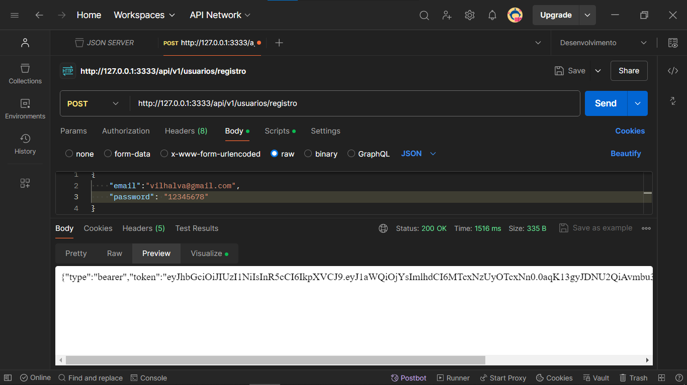
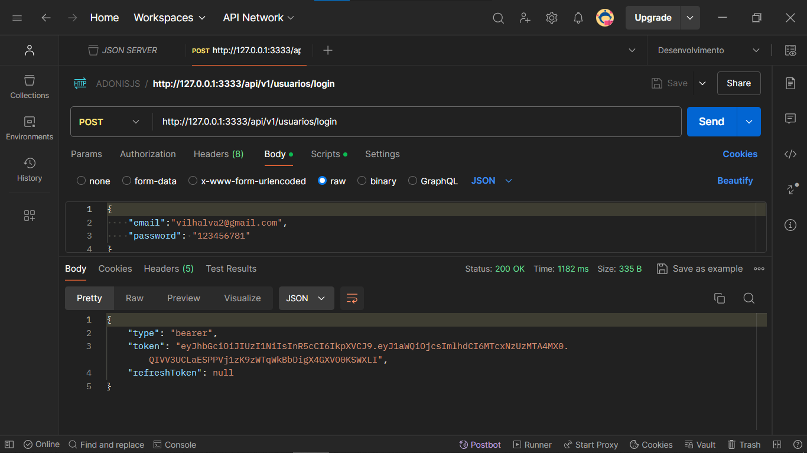
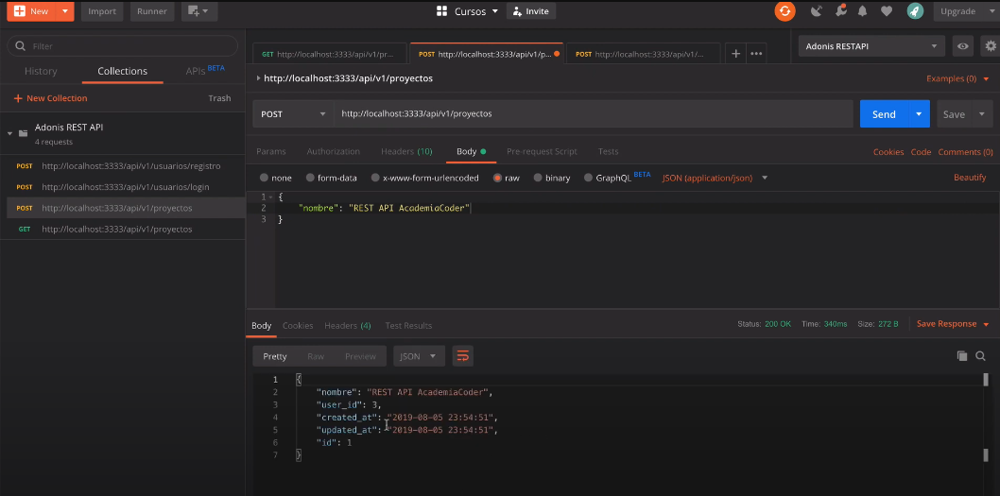
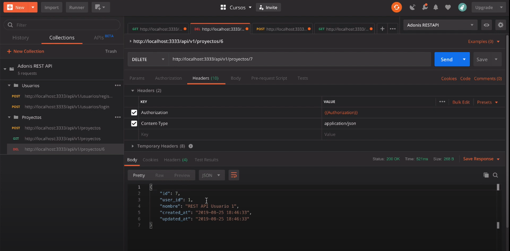
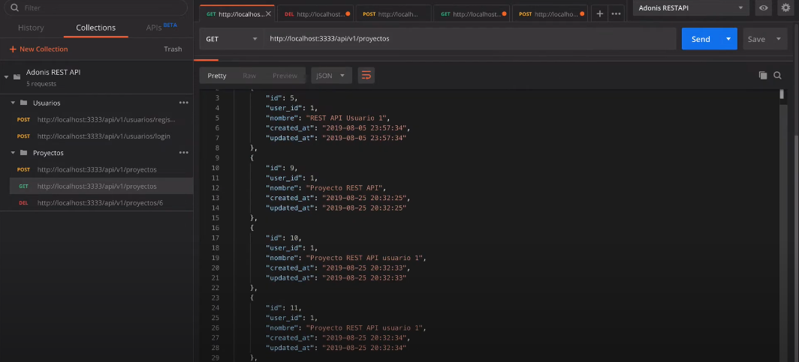
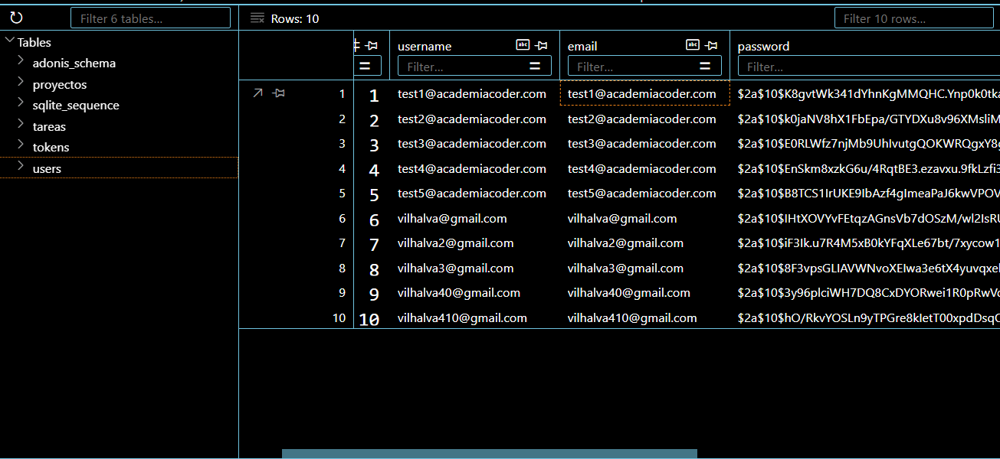

# API RESTFUL COM ADONISJS
👨‍🏫PROJETO CRIADO PARA O CURSO DE ADONISJS.

 <br> 
 <br> 
 <br> 
 <br> 
 <br> 
 <br> 

## DESCRIÇÃO:
Este projeto é uma API RESTful criada com AdonisJS para gerenciamento de usuários, projetos e tarefas. A API permite o registro e login de usuários, bem como a criação, leitura, atualização e exclusão de projetos e tarefas associadas. A autenticação é feita utilizando JWT (JSON Web Token) para proteger as rotas.

## FUNCIONALIDADES:
1. **Registro de Usuários**
   - Rota: `POST /api/v1/usuarios/registro`
   - Descrição: Permite a criação de novos usuários no sistema.

2. **Login de Usuários**
   - Rota: `POST /api/v1/usuarios/login`
   - Descrição: Permite aos usuários existentes fazer login e obter um token JWT.

3. **Gerenciamento de Projetos**
   - Rota: `GET /api/v1/proyectos`
     - Descrição: Retorna a lista de todos os projetos do usuário autenticado.
     - Middleware: `auth`
   - Rota: `POST /api/v1/proyectos`
     - Descrição: Cria um novo projeto.
     - Middleware: `auth`
   - Rota: `PATCH /api/v1/proyectos/:id`
     - Descrição: Atualiza um projeto existente.
     - Middleware: `auth`
   - Rota: `DELETE /api/v1/proyectos/:id`
     - Descrição: Exclui um projeto existente.
     - Middleware: `auth`

4. **Gerenciamento de Tarefas**
   - Rota: `GET /api/v1/proyectos/:id/tareas`
     - Descrição: Retorna a lista de todas as tarefas associadas a um projeto específico.
     - Middleware: `auth`
   - Rota: `POST /api/v1/proyectos/:id/tareas`
     - Descrição: Cria uma nova tarefa para um projeto específico.
     - Middleware: `auth`
   - Rota: `PATCH /api/v1/tareas/:id`
     - Descrição: Atualiza uma tarefa existente.
     - Middleware: `auth`
   - Rota: `DELETE /api/v1/tareas/:id`
     - Descrição: Exclui uma tarefa existente.
     - Middleware: `auth`

## EXECUTANDO O PROJETO:
1. **Instalando as Dependências:**
   - Para instalar as dependências listadas no arquivo "package.json", você pode usar o comando `npm install` no terminal. Certifique-se de estar no diretório `CODIGO` e execute o seguinte comando:
   ```bash
   npm install
   ```

2. **Configure as Variáveis de Ambiente**
   - Crie um arquivo `.env` na raiz do projeto e adicione as seguintes configurações:
     ```env
     HOST=127.0.0.1
     PORT=3333
     NODE_ENV=development

     APP_NAME=AdonisJs
     APP_URL=http://${HOST}:${PORT}

     CACHE_VIEWS=false

     APP_KEY=uma_chave_unica_gerada

     DB_CONNECTION=sqlite
     DB_HOST=127.0.0.1
     DB_PORT=3306
     DB_USER=root
     DB_PASSWORD=
     DB_DATABASE=adonis

     HASH_DRIVER=bcrypt
     ```

3. **Gere uma APP_KEY**
   ```bash
   adonis key:generate
   ```

4. **Execute as Migrações**
   ```bash
   adonis migration:run
   ```

6. **Inicie o Servidor:**
   - Execute o seguinte comando no Terminal:
   ```bash
   npm start
   ```

## EXEMPLOS DE REQUISIÇÕES:
- **Registro de Usuário**
  ```bash
  curl -X POST http://127.0.0.1:3333/api/v1/usuarios/registro -H "Content-Type: application/json" -d '{"username": "testuser", "email": "test@example.com", "password": "secret"}'
  ```

- **Login de Usuário**
  ```bash
  curl -X POST http://127.0.0.1:3333/api/v1/usuarios/login -H "Content-Type: application/json" -d '{"email": "test@example.com", "password": "secret"}'
  ```

- **Listar Projetos**
  ```bash
  curl -X GET http://127.0.0.1:3333/api/v1/proyectos -H "Authorization: Bearer <TOKEN_JWT>"
  ```

- **Criar Projeto**
  ```bash
  curl -X POST http://127.0.0.1:3333/api/v1/proyectos -H "Authorization: Bearer <TOKEN_JWT>" -H "Content-Type: application/json" -d '{"name": "Novo Projeto"}'
  ```

## NÃO SABE?
- Entendemos que para manipular arquivos em `HTML`, `CSS` e outras linguagens relacionadas, é necessário possuir conhecimento nessas áreas. Para auxiliar nesse aprendizado, oferecemos cursos gratuitos disponíveis:
* [CURSO DE JAVASCRIPT](https://github.com/VILHALVA/CURSO-DE-JAVASCRIPT)
* [CURSO DE NODEJS](https://github.com/VILHALVA/CURSO-DE-NODEJS)
* [CURSO DE SQLITE](https://github.com/VILHALVA/CURSO-DE-SQLITE)
* [CONFIRA MAIS CURSOS](https://github.com/VILHALVA?tab=repositories&q=+topic:CURSO)

## CREDITOS:
- [PROJETO FEITO PELO VILHALVA](https://github.com/VILHALVA)
- [PROJETO CRIADO PARA O CURSO DE ADONISJS](https://github.com/VILHALVA/CURSO-DE-ADONISJS)


